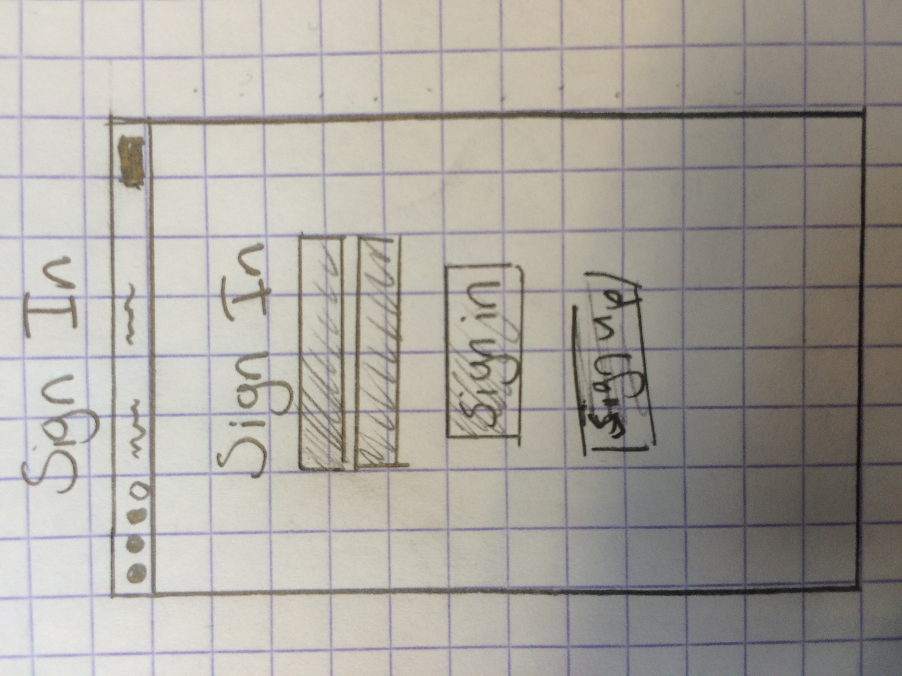
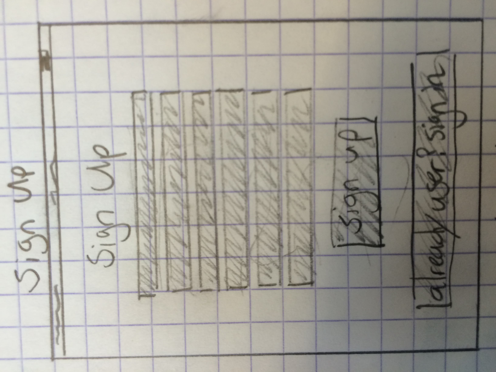
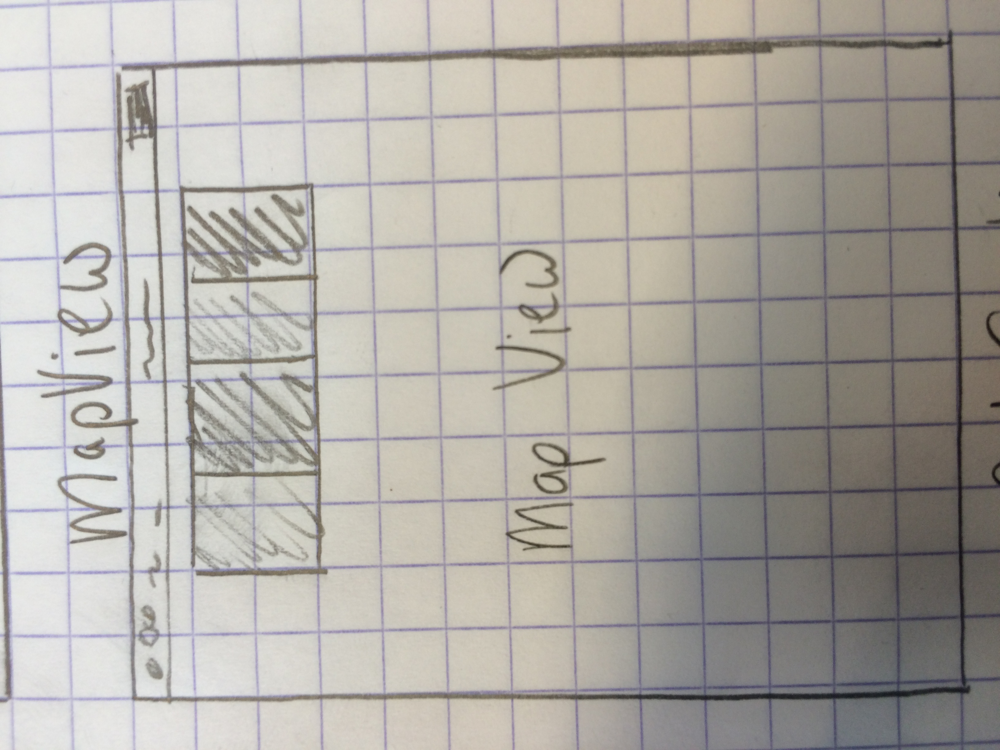
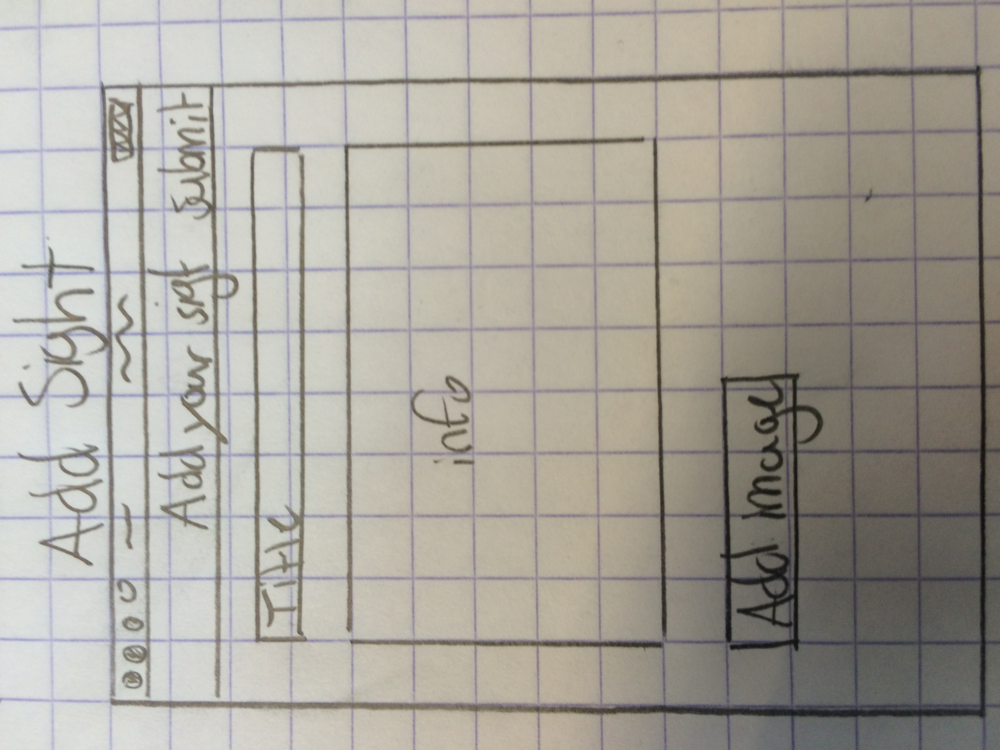
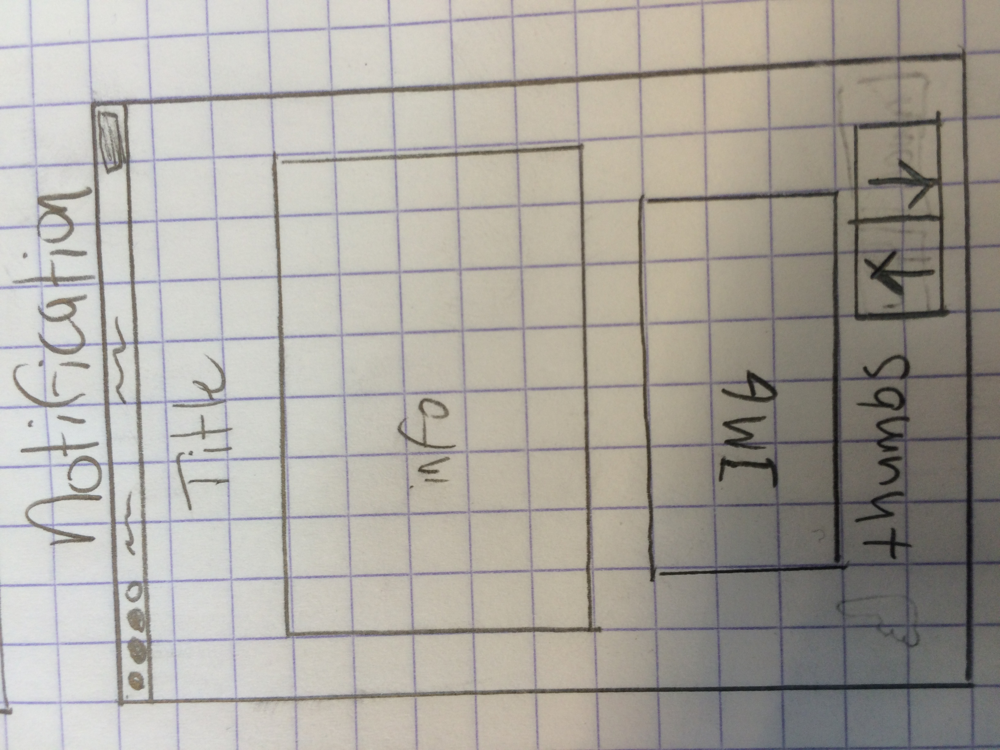
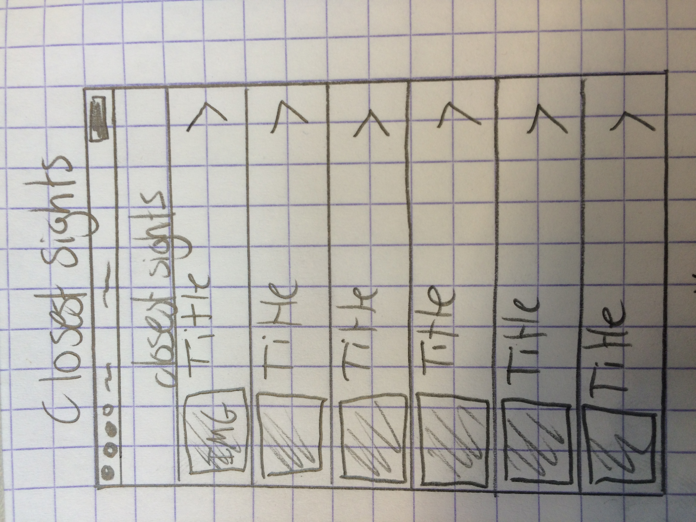

# TourGuide

Ewoud Hermans

Solved problem for the user

This is the proposal for an updated version of the TourGuide app. The TourGuide app is an application that, based on your GPS location, gives you notifications about sights nearby. The idea is that when you walk by a certain sight, let’s say The Eiffel Tower, the app gives you a notification. The notification includes a title, a short description and possibly a picture.

The idea is that users can add information about sights themselves within the app. So when you think you have something interesting to tell about a certain sight, you can add information to a database for other people to read. When other users later walk by the location where you added your information they get a notification.

The update for this app is that information added by users can be rated by other users. This because we want the database to be filled with useful and interesting information. So when you get a notification because you walked by a certain sight and you decide to read the information, you have the possibility to give the information a thumbs up or a thumbs down. When a piece of information has more then ten thumbs down, that piece will be removed from the database.

Features

•	Takes your location into account (uses GPS).
•	Gives you notifications about sights corresponding to your location.
•	Users can see nearby sights on a map.
•	User can add information to a database, and the information is linked to a GPS location.
•	User can add an image corresponding to a location.
•	User has to make a user account.
•	Once logged in, the user does not have to keep logging in when app is closed.
•	User can rate information added by other users (thumbs up/down.
•	Information is removed from the database when that piece of information has more than ten thumbs down.

Databases

1.	Users – There will be a user’s database with corresponding passwords and profile information provided by the users.
2.	Information – There will be an information database provided by the users (about the sights).
3.	Titles – There will be a database filled with the titles of the locations.
4.	Database – There will be a database filled with images corresponding to certain locations.
5.	Locations – There will be a database of GPS locations, these locations (also provided by the user) should correspond to pieces in the information database.
6.	Ratings – There will be a database the keeps track of how many thumbs up or down a certain piece of information has.

Parts of the application

•	Account creation interface.
•	Log in interface.
•	Map with pins that represent the sights in the database.
•	Notification interface (where you read the information about the sights and have the possibility to read that piece of information).
•	Interface where you add a new sight to the database.
•	Interface that shows (in a table view) the ten closest sights.

